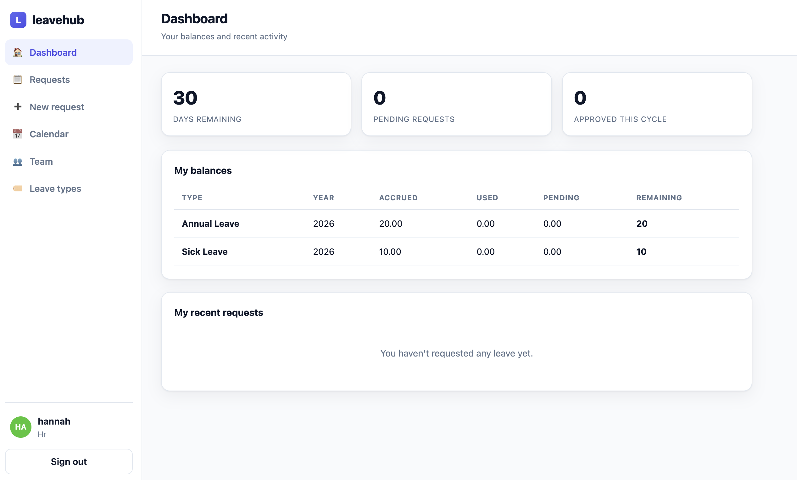
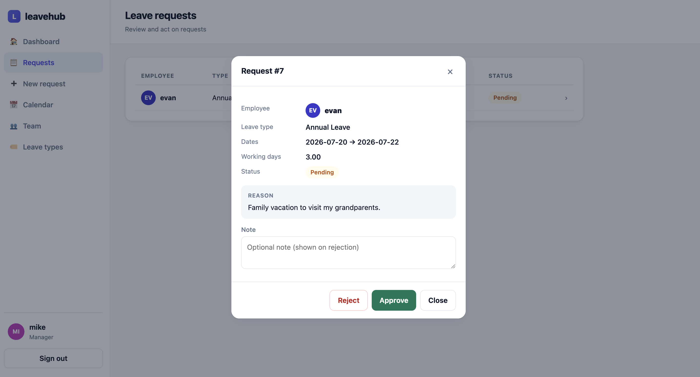
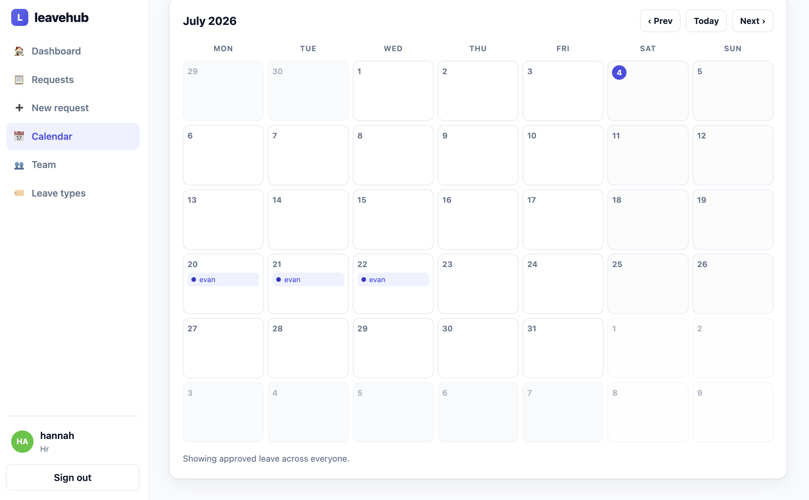

# leavehub


**Live demo:** https://leavehub.onrender.com — log in as `hannah` / `leavehub123` (HR)
or `mike` / `leavehub123` (manager). Runs on a free instance that sleeps when idle, so
the first load can take ~30 seconds; demo data resets on every boot.

A leave & attendance management app — employees request time off against a balance, managers
approve or reject, and HR configures policy. Built as a **JWT-secured Django REST API**
(`/api/v1/`, versioned, paginated, rate-limited) with a small **vanilla-JS single-page UI**
served from the same origin.

The interesting part isn't the CRUD — it's the **balance accounting**: approving a request
isn't flipping a status, it's doing money-like math on a shared counter that two managers
might touch at the same moment. That concurrency-safe balance logic, plus the role-based
authorization rules, are the heart of the project.

## Web UI

A small vanilla-JS client served at `/` — dashboard, requests with a detail/decision modal,
a month-grid team calendar, a team roster, and HR leave-type management. No build step.

**Dashboard** — balances and at-a-glance KPIs


**Reviewing a request** — the reason is shown before you approve or reject


**Team calendar** — approved leave on a month grid (managers and HR)



## Features

- **JWT auth** — register, login, and silent token refresh.
- **Validated leave requests** — server computes working days (excludes weekends + company
  holidays) and rejects past dates, zero-day ranges, insufficient balance, and overlaps.
- **Concurrency-safe balances** — every approval/rejection/cancellation adjusts the balance
  inside one DB transaction with the row locked (`SELECT … FOR UPDATE`), so the last day
  can't be double-booked.
- **Role-based authorization** — employee / manager / HR, including **no self-approval**
  (an HR's own request is decided by another HR) and owner-only, pending-only cancellation.
- **Team calendar** (managers/HR) and **team roster**, both role-scoped.
- **Scheduled jobs** — monthly accrual and year-end carry-over as management commands (cron).
- **OpenAPI schema + Swagger UI**, and a **web client** with no build step.

## Roles & permissions

| Action | Employee | Manager | HR |
|--------|----------|---------|----|
| Request leave | own | own | own |
| See requests | own | own + team | all |
| Approve / reject | no | team | anyone |
| Cancel (while pending) | own | own | own |
| Team calendar & roster | no | team | all |
| Manage leave types | no | no | yes |

Approve/reject never applies to your own request — so an HR's request is decided by
another HR.

## Tech stack

- **Python 3.14, Django 6, Django REST Framework**
- **SimpleJWT** (auth), **drf-spectacular** (OpenAPI)
- **PostgreSQL** (`psycopg2-binary`), config via **python-dotenv**
- **gunicorn + WhiteNoise**, Dockerfile & docker-compose
- Frontend: **vanilla JS + HTML/CSS**, single file, no build tooling
- Tooling: **ruff** (lint + format), **coverage**, **pre-commit**, **GitHub Actions CI**

## Architecture

Single Django project (`leavehub`) with one app (`leave`). `LeaveRequest` is the aggregate:
its working-day count excludes weekends and holidays, and its status transitions live as
**methods on the model** (`approve`/`reject`/`cancel`) so the state machine — and the balance
math tied to each transition — is enforced in one place. `perform_create` re-checks the
balance under a row lock to close a submit-time race the serializer can't. Accrual and
carry-over run outside the request cycle as management commands. See
[`docs/ARCHITECTURE.md`](docs/ARCHITECTURE.md), [`docs/DATABASE.md`](docs/DATABASE.md),
[`docs/BUSINESS_LOGIC.md`](docs/BUSINESS_LOGIC.md), [`docs/API.md`](docs/API.md), and
[`docs/DEPLOYMENT.md`](docs/DEPLOYMENT.md) for the full design and operations guide.

## Running locally

Requires PostgreSQL. Start one with `docker compose up -d`.

```bash
python3 -m venv .venv && source .venv/bin/activate
pip install -r requirements.txt

cp .env.example .env          # set DJANGO_SECRET_KEY and POSTGRES_PASSWORD

python manage.py migrate
python manage.py seed_demo    # loads a demo org: users, types, balances, sample requests
python manage.py runserver
```

Open **http://localhost:8000/** for the web UI, `/admin/` for Django admin, and
`/api/v1/docs/` for Swagger.

### Demo accounts

`seed_demo` creates these — every password is `leavehub123`:

| Username | Role | Team | Manager |
|----------|------|------|---------|
| `hannah` | HR | People | — |
| `mike` | Manager | Engineering | hannah |
| `nina` | Manager | Design | hannah |
| `evan`, `emma` | Employee | Engineering | mike |
| `derek`, `dora` | Employee | Design | nina |
| `admin` | HR + superuser | People | — |

Try it: sign in as **evan** and submit leave with a reason; sign in as **mike** or **hannah**
to open the request and approve/reject it; then check the **Calendar**. Re-seed a clean slate
anytime with `python manage.py seed_demo --reset`.

## Running tests

```bash
python manage.py test
coverage run manage.py test && coverage report   # gate: 85%+

pip install -r requirements-dev.txt
pre-commit install
ruff check . && ruff format --check .
```

40 tests cover the day counter, balance math, every state transition, the authorization
rules, validation, the API endpoints, and the management commands.

## API endpoints

```
POST   /api/v1/auth/register/                register a user
POST   /api/v1/auth/token/  (+ /refresh/)    obtain / refresh JWT

GET    /api/v1/me/                            current user (id, username, role, team)
GET    /api/v1/me/balances/                   current user's balances
GET    /api/v1/employees/                     roster, role-scoped

GET    /api/v1/leave-types/                   list (HR creates / edits / deletes)

GET    /api/v1/calendar/                      team calendar (manager/HR, date-filtered)
GET    /api/v1/leave-requests/                list (own / reports' / all by role)
POST   /api/v1/leave-requests/                create (validates balance + overlap + dates)
GET    /api/v1/leave-requests/{id}/           retrieve

POST   /api/v1/leave-requests/{id}/approve/   -> approved  (manager/HR, not the author)
POST   /api/v1/leave-requests/{id}/reject/    -> rejected  (optional note)
POST   /api/v1/leave-requests/{id}/cancel/    -> cancelled (owner, pending only)

GET    /api/v1/schema/  ·  /api/v1/docs/      OpenAPI schema · Swagger UI
```

## Deployment

Serves under gunicorn with WhiteNoise; ships a `Dockerfile`.

```bash
docker build -t leavehub .
# at deploy: migrate && collectstatic --noinput, then gunicorn leavehub.wsgi
```

Set `DJANGO_DEBUG=False`, real `DJANGO_ALLOWED_HOSTS`, and the HTTPS env vars, then confirm a
clean `DJANGO_DEBUG=False python manage.py check --deploy`. Schedule `accrue_leave` (monthly)
and `carry_over` (year end) via cron — see `deploy/crontab.example`.

## What I learned

- **The balance is the thing to protect.** Every status change moves numbers between
  `pending` and `used`, and those moves must stay consistent with `status`. Keeping transitions
  as methods on `LeaveRequest` meant there was exactly one place a balance could change.
- **Validation alone doesn't prevent over-booking.** The serializer checks `remaining` without
  a lock, so two concurrent requests can both pass. The real guard is re-checking under
  `select_for_update()` inside the create transaction — that row lock is what stops two people
  spending the same last day.
- **Authorization is domain logic, not an afterthought.** "No self-approval" and "an HR's
  request goes to another HR" only became clean once I separated *who can see* a request
  (queryset scoping) from *who can act* on it (an explicit decision guard).
- **Compute derived values on the server.** `days` comes from a pure `working_days()` helper,
  never the client — which made it easy to test hard, since everything downstream leans on it.
- **Some jobs don't belong in the request cycle.** Accrual and carry-over are periodic, so
  they're management commands on a schedule — no Celery needed for this scope.

## License

Released under the [MIT License](LICENSE).
```
